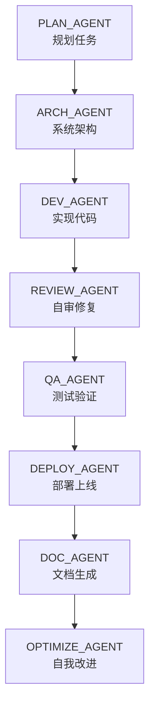

# 🧠 AGENTS.md — Codex 专用开发版
> **Codex 多智能体协作规范 v1.0**  
> _用途：让 Codex 在开发中可自我角色切换、自审、自优化。_

---

## 🚀 一、文档目的
Codex 不仅能写代码，它本身可以“分身”为多个功能角色（Agents）。  
本文件定义：
- Codex 的角色与职责；
- 每个角色的输入输出标准；
- 各 Agent 如何在同一开发流程中协作、自检、自修；
- 如何让 Codex 自我优化与持续改进。

🎯 目标：让 Codex 能像一个完整的开发团队一样协作与进化。

---

## 🧩 二、Codex 智能体角色定义
| 名称 | 职责定位 | 说明 / 功能 | 常用命令 |
|------|-----------|--------------|-----------|
| 🦯 **PLAN_AGENT** | 产品规划师 | 把需求转为任务树与技术路线 | `/plan` |
| 🟑 **DEV_AGENT** | 全栈工程师 | 编写前端 / 后端 / 配置文件 | `/dev` |
| 🧩 **ARCH_AGENT** | 架构设计师 | 设计文件结构 / 数据库 / 接口规范 | `/arch` |
| 🦯 **DATA_AGENT** | 数据建模师 | 生成 schema、seed、Supabase 连接 | `/data` |
| 🧮 **REVIEW_AGENT** | 代码审查员 | 自动 lint / type / test / 优化修复 | `/review` |
| 🤮 **QA_AGENT** | 测试工程师 | 执行单测、端到端测试、视觉回归 | `/qa` |
| 🚀 **DEPLOY_AGENT** | 运维工程师 | 构建、发布、部署上线 | `/deploy` |
| 📏 **DOC_AGENT** | 技术文档师 | 自动生成 README、API Docs、手册 | `/doc` |
| 🧠 **OPTIMIZE_AGENT** | 自我优化器 | 分析代码质量与性能瓶颈并改进 | `/optimize` |

---

## ⚙️ 三、工作模型


---

## 🗾 四、输入与输出
### 通用输入参数
| 参数 | 示例 | 说明 |
|------|------|------|
| `OBJECTIVE` | “构建一套 AI 学习系统” | 项目目标 |
| `CONTEXT` | “前端 React，后端 Supabase，部署 GitHub Pages” | 技术背景 |
| `QUALITY_LEVEL` | `production` 或 `prototype` | 质量目标 |
| `SCOPE` | `frontend` / `backend` / `fullstack` | 任务范围 |

### 通用输出格式
```json
{
  "agent": "DEV_AGENT",
  "status": "completed",
  "summary": "Created API endpoints and linked Supabase.",
  "files_modified": ["src/api/students.ts"],
  "confidence": 0.94,
  "next_agent": "REVIEW_AGENT"
}
```

---

## 📚 五、执行阶段
| 阶段 | 执行者 | 描述 | 示例输出 |
|------|----------|------|-----------|
| 1️⃣ 任务规划 | PLAN_AGENT | 拆解目标 → 子任务 → 输出执行清单 | 任务树 / PRD |
| 2️⃣ 架构设计 | ARCH_AGENT | 设计项目结构 / 数据库 / API | schema / 目录结构 |
| 3️⃣ 开发实现 | DEV_AGENT | 编写核心功能代码 | 功能模块 |
| 4️⃣ 自审修复 | REVIEW_AGENT | Lint / Type / Test / Fix | 报告 + patch |
| 5️⃣ 测试验证 | QA_AGENT | 单测、集成、端到端测试 | test-report.json |
| 6️⃣ 部署上线 | DEPLOY_AGENT | 构建 + 推送 + 发布 | 部署 URL |
| 7️⃣ 文档生成 | DOC_AGENT | 生成技术文档 | README.md |
| 8️⃣ 自我优化 | OPTIMIZE_AGENT | 分析代码 / 性能 / 架构改进 | OPTIMIZE_REPORT.md |

---

## 🧬 六、质量闸门 (Quality Gates)
| 检查项 | 工具 / 方法 | 标准 | 行动 |
|---------|-------------|-------|--------|
| Lint & Style | ESLint + Prettier | 无错误 | 自动修复 |
| Type Safety | TypeScript strict | 无 any/unknown | 阻止合并 |
| Tests | Vitest / Playwright | ≥80% 覆盖率 | 自动补测 |
| Architecture | dependency-cruiser | 无环依赖 | 自动警告 |
| Performance | Lighthouse / bundle-analyze | 90+ 分 | 压缩优化 |
| Security | npm audit / osv | 无高危漏洞 | 打标签“needs fix” |
| Docs | 自动生成文档 | 文件存在 | 自动生成 |

---

## 🧠 七、自我优化机制
OPTIMIZE_AGENT 每次构建后执行：
1. 分析最近 5 次提交；
2. 检测重复代码与性能瓶颈；
3. 生成改进报告到 `docs/OPTIMIZE_REPORT.md`；
4. 若结构问题严重，通知 ARCH_AGENT 重新设计架构。

---

## 📚 八、Definition of Done
任务完成必须满足：
- ✅ 所有质量检查通过；
- ✅ 所有测试绿灯；
- ✅ 审查无问题；
- ✅ 文档更新；
- ✅ 自评置信度 ≥ 0.9；
- ✅ 执行日志写入 `/logs/agent-state.json`。

---

## 📃 九、执行日志格式
```json
{
  "timestamp": "2025-10-17T12:00:00Z",
  "agent": "DEV_AGENT",
  "status": "completed",
  "commit": "a8b91f3",
  "quality": {"lint": "pass", "type": "pass", "test": "pass"},
  "next": "REVIEW_AGENT"
}
```

---

## 🧩 十、推荐项目结构
```
AI-gongzuoliu/
 ├── AGENTS.md
 ├── packages/
 │    ├── plan-agent.yaml
 │    ├── dev-agent.yaml
 │    ├── review-agent.yaml
 │    ├── qa-agent.yaml
 │    ├── deploy-agent.yaml
 │    └── optimize-agent.yaml
 ├── logs/
 │    └── agent-state.json
 ├── docs/
 │    └── AGENTS_CHANGELOG.md
 └── .github/workflows/
      └── quality.yml
```

---

## 🔠 十一、初始化命令
首次使用执行：
```
/setup agents
```
Codex 自动创建目录与配置文件。
然后运行：
```
/run Master-Pipeline --OBJECTIVE="测试完整流程"
```

---

## ✅ 十二、总结
通过本规范，Codex 能：
- 自动识别角色；
- 执行完整开发生命周期；
- 自我审查、自我修复、自我优化；
- 构建真正的「AI 自动化开发团队」。

---

> 📍 保存路径：`AI-gongzuoliu/AGENTS.md`
```

---

## ⚙️ `AI-gongzuoliu/agents-setup.yaml`
```yaml
name: setup-agents
description: 初始化 Codex 智能体体系结构（Agents Framework）
inputs:
  PROJECT_NAME: "AI-gongzuoliu"
steps:
  - name: 创建基础目录结构
    command: |
      mkdir -p packages logs docs .github/workflows
      echo "[]" > logs/agent-state.json
      echo "# AGENTS_CHANGELOG\n\n> 记录智能体演化、更新与性能改进\n" > docs/AGENTS_CHANGELOG.md

  - name: 创建 PLAN_AGENT
    command: |
      cat > packages/plan-agent.yaml << 'EOF'
      name: PLAN_AGENT
      description: 负责任务规划与需求拆解
      inputs: [OBJECTIVE, CONTEXT, SCOPE]
      steps:
        - name: 拆解目标
          command: |
            解析 OBJECTIVE -> 输出任务树 -> 生成 PRD
        - name: 输出结果
          command: |
            echo "✅ 规划完成，输出 PRD.md 与任务结构"
      outputs:
        - plans/PRD.md
      EOF

  - name: 创建 DEV_AGENT
    command: |
      cat > packages/dev-agent.yaml << 'EOF'
      name: DEV_AGENT
      description: 全栈开发智能体，编写核心功能与结构
      inputs: [OBJECTIVE, CONTEXT, SCOPE]
      steps:
        - name: 编写代码
          command: |
            读取 PRD.md -> 编写前端/后端代码 -> 本地测试通过
        - name: 自测
          command: |
            npm run lint && npm run test || true
        - name: 输出结果
          command: |
            echo "✅ 开发完成，已生成代码模块"
      outputs:
        - src/*
      EOF

  - name: 创建 REVIEW_AGENT
    command: |
      cat > packages/review-agent.yaml << 'EOF'
      name: REVIEW_AGENT
      description: 审查与自修复智能体，执行 lint/type/test/优化
      inputs: [CONTEXT]
      steps:
        - name: 审查与修复
          command: |
            npm run lint && npm run typecheck && npm run test -- --coverage || echo "⚠️ 自动修复中"
       


---

## 🚦 `AI-gongzuoliu/Master-Pipeline.yaml`
```yaml
name: Master-Pipeline
description: Codex 全流程调度管线（PLAN → ARCH → DEV → REVIEW → QA → DEPLOY → DOC → OPTIMIZE）

# 可在 /run 时覆盖的输入参数
inputs:
  OBJECTIVE: "请用一句话描述项目目标"
  CONTEXT: "前端 React，后端 Supabase，部署 GitHub Pages"
  SCOPE: "fullstack"        # 可选：frontend / backend / fullstack / docs
  QUALITY_LEVEL: "production" # 或 prototype
  APP_DIR: "app"             # 代码目录（不存在则按需创建）
  SUPABASE_URL: ""
  SUPABASE_KEY: ""

steps:
  - name: 环境准备
    command: |
      echo "🔧 初始化环境…"
      git status || true
      git pull --rebase origin main || true
      mkdir -p plans docs logs packages .github/workflows
      echo "{}" > logs/agent-state.json 2>/dev/null || true

  - name: 需求规划（PLAN_AGENT）
    command: |
      echo "🧭 规划: ${{ inputs.OBJECTIVE }}"
      /run PLAN_AGENT \
        --OBJECTIVE="${{ inputs.OBJECTIVE }}" \
        --CONTEXT="${{ inputs.CONTEXT }}" \
        --SCOPE="${{ inputs.SCOPE }}"

  - name: 架构设计（ARCH_AGENT）
    command: |
      echo "🏗️ 架构设计…"
      /run ARCH_AGENT \
        --OBJECTIVE="${{ inputs.OBJECTIVE }}" \
        --CONTEXT="${{ inputs.CONTEXT }}" \
        --SCOPE="${{ inputs.SCOPE }}"

  - name: 数据与后端（DATA_AGENT，可选 Supabase）
    command: |
      if [ -n "${{ inputs.SUPABASE_URL }}" ] && [ -n "${{ inputs.SUPABASE_KEY }}" ]; then
        echo "🌱 接入 Supabase"
        /run DATA_AGENT \
          --OBJECTIVE="${{ inputs.OBJECTIVE }}" \
          --CONTEXT="${{ inputs.CONTEXT }}" \
          --SCOPE="backend" \
          --APP_DIR="${{ inputs.APP_DIR }}" \
          --SUPABASE_URL="${{ inputs.SUPABASE_URL }}" \
          --SUPABASE_KEY="${{ inputs.SUPABASE_KEY }}"
      else
        echo "🌱 略过 Supabase（未提供 SUPABASE_URL/KEY）"
      fi

  - name: 开发实现（DEV_AGENT）
    command: |
      echo "🧱 开发实现…"
      /run DEV_AGENT \
        --OBJECTIVE="${{ inputs.OBJECTIVE }}" \
        --CONTEXT="${{ inputs.CONTEXT }}" \
        --SCOPE="${{ inputs.SCOPE }}"

  - name: 自审与修复（REVIEW_AGENT）
    command: |
      echo "🔍 自审与修复…"
      /run REVIEW_AGENT --CONTEXT="${{ inputs.CONTEXT }}"

  - name: 测试验证（QA_AGENT）
    command: |
      echo "🧪 执行测试…"
      /run QA_AGENT --SCOPE="${{ inputs.SCOPE }}"

  - name: 部署上线（DEPLOY_AGENT）
    command: |
      echo "🚀 部署… QUALITY=${{ inputs.QUALITY_LEVEL }}"
      /run DEPLOY_AGENT \
        --CONTEXT="${{ inputs.CONTEXT }}" \
        --QUALITY_LEVEL="${{ inputs.QUALITY_LEVEL }}"

  - name: 文档生成（DOC_AGENT）
    command: |
      echo "🧾 生成文档…"
      /run DOC_AGENT \
        --OBJECTIVE="${{ inputs.OBJECTIVE }}" \
        --CONTEXT="${{ inputs.CONTEXT }}"

  - name: 自我优化（OPTIMIZE_AGENT）
    command: |
      echo "🧠 优化与反思…"
      /run OPTIMIZE_AGENT --CONTEXT="${{ inputs.CONTEXT }}"

  - name: 写入执行日志
    command: |
      echo '{"status":"done","objective":"'"${{ inputs.OBJECTIVE }}"'"}' > logs/agent-state.json
      echo "✅ 全流程完成"
```


